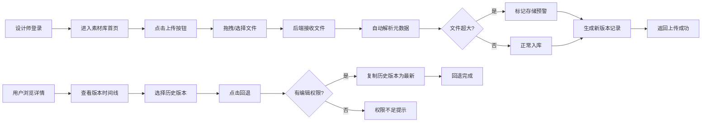

## 1. 产品概述

团队3D素材资产管理系统，解决团队协作中3D模型、贴图素材版本混乱、文件覆盖、权限不清的核心问题。面向设计师与资产管理员，提供集中化素材库管理、多版本留存、权限控制与批量归档能力。

- **核心价值**：杜绝多人协作覆盖风险，精确追踪素材迭代历史，细粒度权限保障资产安全
- **目标用户**：3D设计师、美术团队、资产管理员、项目负责人

## 2. 核心功能

### 2.1 用户角色

| 角色 | 注册方式 | 核心权限 |
|------|----------|----------|
| 管理员 | 系统创建 | 全权限：素材上传/编辑/删除、用户管理、权限分配、批量归档 |
| 编辑者 | 管理员分配 | 素材上传、编辑本人素材、查看所有素材、回退版本 |
| 只读用户 | 管理员分配 | 素材浏览、下载、预览，不可提交任何修改 |

### 2.2 功能模块

1. **登录页**：账号密码登录、角色识别、权限初始化
2. **素材库首页（Dashboard）**：素材网格/列表视图、分类筛选、搜索、存储预警面板、上传入口
3. **素材详情页**：3D预览、信息面板（面数/分辨率/大小）、版本时间线、版本回退操作
4. **上传页面**：拖拽上传、自动解析元数据、超大文件标记、版本备注输入
5. **用户权限管理页**：成员列表、角色分配、权限修改、新增/禁用账号
6. **归档中心**：过期素材筛选、批量归档、归档记录、恢复操作

### 2.3 页面详情

| 页面名称 | 模块名称 | 功能描述 |
|----------|----------|----------|
| 登录页 | 登录表单 | 账号密码输入、错误提示、登录后路由至首页 |
| 素材库首页 | 顶部导航栏 | 系统Logo、搜索框、用户头像下拉（个人信息/退出）、上传按钮 |
| 素材库首页 | 侧边筛选栏 | 按类型（模型/贴图）、标签、上传者、归档状态筛选 |
| 素材库首页 | 存储预警面板 | 显示存储占用比例、超大资源列表、超限提醒标记 |
| 素材库首页 | 素材卡片网格 | 缩略图、名称、类型标签、当前版本号、最后修改者与时间、权限徽章 |
| 素材详情页 | 3D预览区 | Three.js渲染器、旋转缩放交互、线框/实体切换 |
| 素材详情页 | 元数据面板 | 文件大小、面数、顶点数、贴图分辨率、格式、创建时间 |
| 素材详情页 | 版本时间线 | 所有历史版本卡片、版本号、修改备注、操作者、回退按钮 |
| 上传页面 | 上传区域 | 拖拽/点击选择、进度条、多文件队列、取消操作 |
| 上传页面 | 解析结果展示 | 自动解析后显示面数、分辨率、是否超大文件标记 |
| 用户权限管理页 | 成员列表表格 | 头像、姓名、账号、角色标签、状态、操作列（编辑/禁用） |
| 用户权限管理页 | 角色分配弹窗 | 下拉选择角色、确认操作、权限说明提示 |
| 归档中心 | 归档操作区 | 过期时间筛选、批量勾选、一键归档按钮 |
| 归档中心 | 归档记录列表 | 归档时间、操作人、素材数量、恢复按钮 |

## 3. 核心流程

### 3.1 素材上传与解析流程

设计师登录系统 → 点击上传按钮 → 拖拽或选择本地3D/贴图文件 → 系统接收文件至后端 → 后端自动解析文件元数据（面数/分辨率/大小）→ 判定是否超大资源并标记预警 → 生成新版本号 → 存入素材库 → 返回上传成功结果

### 3.2 版本回退流程

用户进入素材详情页 → 查看版本时间线 → 选择目标历史版本 → 点击"回退到此版本" → 系统校验当前用户是否有编辑权限 → 校验通过后复制历史版本为最新版本 → 生成新版本记录 → 更新当前版本指针 → 回退完成

### 3.3 并发编辑权限拦截流程

用户A打开素材进入编辑状态 → 系统记录锁定状态 → 用户B尝试编辑同一素材 → 后端校验权限与锁定状态 → 检测到素材正在被编辑 → 返回拦截提示"该素材正在被XXX编辑中" → 用户B可选择等待或通知对方

### 3.4 Mermaid 流程图

## 4. 用户界面设计

### 4.1 设计风格

- **主色调**：深空蓝 `#0F172A` 作为主背景色，配合青蓝 `#38BDF8` 作为强调色
- **辅助色**：警示橙 `#F59E0B`（存储预警）、成功绿 `#10B981`（操作成功）、危险红 `#EF4444`（删除/禁用）
- **字体方案**：展示字体使用 `Orbitron`（科技感标题），正文字体使用 `JetBrains Mono`（等宽数字，适合显示面数、分辨率等技术数据）
- **按钮风格**：直角微倒角（4px）、2px边框、悬停发光效果（box-shadow），符合3D/科技主题
- **布局风格**：深色仪表盘风格，左侧固定导航 + 顶部面包屑 + 主内容区卡片化布局
- **图标风格**：Lucide 线性图标，统一描边宽度，配合青色发光悬停效果
- **视觉氛围**：噪点纹理背景、玻璃拟态卡片（backdrop-blur）、微妙网格线装饰、渐变发光边框

### 4.2 页面设计概览

| 页面名称 | 模块名称 | UI元素 |
|----------|----------|--------|
| 登录页 | 登录容器 | 居中玻璃卡片、背景动态3D网格、输入框聚焦发光、登录按钮脉冲加载动画 |
| 素材库首页 | 侧边栏 | 折叠式导航、激活项青蓝高亮、图标+文字、悬停背景微动效 |
| 素材库首页 | 素材卡片 | 缩略图占位（几何渐变）、悬浮上浮+阴影、角标（预警/锁定/只读）、信息排版对齐网格 |
| 素材详情页 | 3D预览区 | 深色渲染背景、辅助坐标轴、右上角工具条（视图切换/全屏）、角落标签信息 |
| 素材详情页 | 版本时间线 | 垂直时间轴、连接线动画、当前版本高亮脉冲、旧版本半透明 |
| 上传页面 | 拖拽区 | 虚线边框、拖拽进入时边框变实+发光+背景微亮、中央图标放大动效 |
| 用户权限管理页 | 成员表格 | 斑马纹、角色标签彩色背景、操作按钮悬停展开、整行悬浮高亮 |
| 归档中心 | 批量操作栏 | 固定顶部、选中数量徽章、归档按钮危险色渐变、确认弹窗二次校验 |

### 4.3 响应式

- 桌面优先设计，最小支持宽度 1280px
- 侧边栏在 1024px 以下可折叠为图标模式
- 素材卡片网格：4列（1440px+）→ 3列（1280px）→ 2列（1024px）→ 单列（768px以下）
- 表格在移动端切换为卡片式列表展示

### 4.4 3D场景指引（预览区）

- **环境/HDRI**：Studio 环境光，中性灰渐变背景，柔和反射
- **光照设置**：三点光照（主光Key + 辅光Fill + 背光Rim），高光清晰无过曝
- **相机设置**：Perspective相机，初始45°俯视角，OrbitControls环绕控制，自动限制近远裁剪面
- **构图与焦点元素**：模型居中占画布70%，边缘留白，背景微妙粒子效果装饰
- **交互与动画**：初始加载淡入动画，空闲时极缓慢自转，拖拽停止有惯性缓动
- **后处理效果**：SSAO环境光遮蔽增强立体感，Bloom自发光材质（如有），轻微Vignette暗角
- **性能预算**：单模型预览限制100万面，超限时自动降采样或提示线框模式
