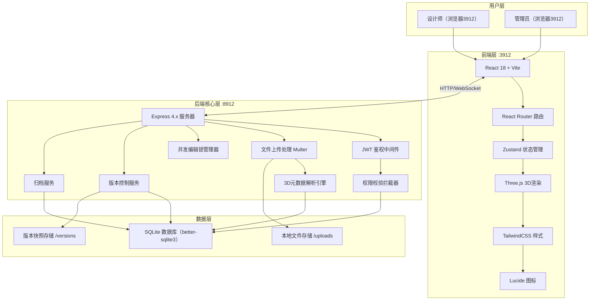
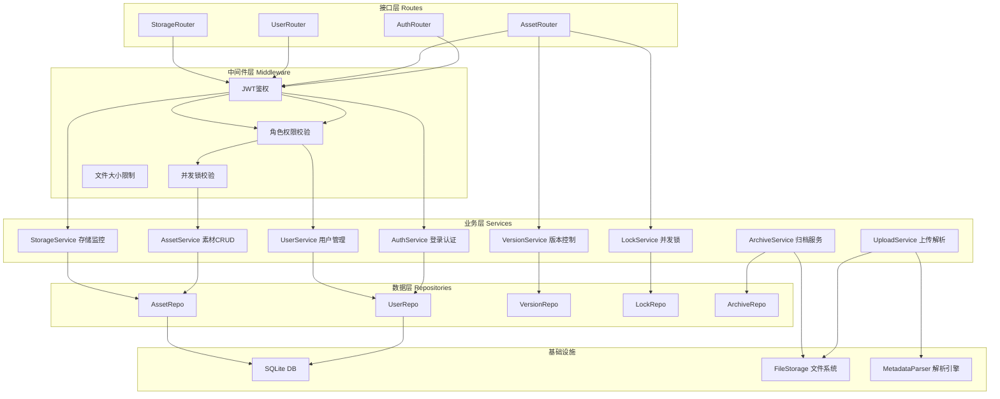
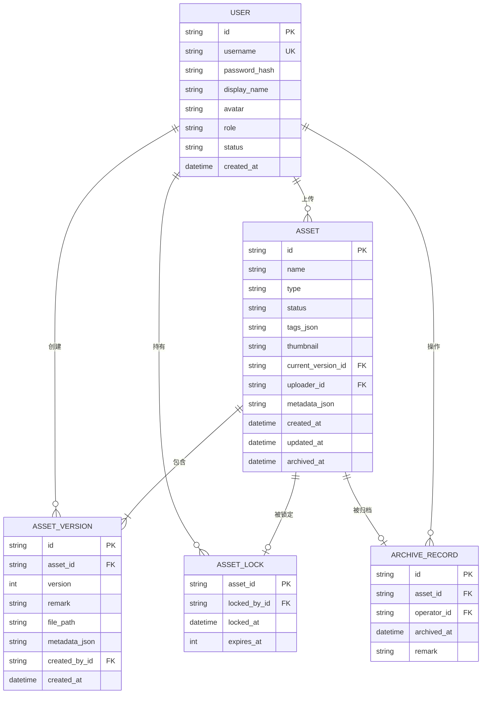

## 1. 架构设计



## 2. 技术说明

- **前端**：React@18 + TypeScript + TailwindCSS@3 + Vite + Zustand + React Router + Three.js + @react-three/fiber + @react-three/drei + lucide-react
- **初始化工具**：vite-init（react-express-ts模板）
- **后端**：Express@4 + TypeScript + ESM + better-sqlite3（零配置本地数据库）+ Multer（文件上传）+ jsonwebtoken（鉴权）
- **数据库**：SQLite（单文件数据库，开箱即用，无需额外服务）+ 本地文件系统存储资源文件
- **3D解析**：使用 three.js 的 GLTFLoader/OBJLoader 在后端解析模型面数/顶点数；使用 sharp 解析贴图分辨率

## 3. 路由定义

| 前端路由 | 页面用途 |
|----------|----------|
| /login | 登录页 |
| /dashboard | 素材库首页（网格视图） |
| /asset/:id | 素材详情页（含3D预览、版本时间线） |
| /upload | 素材上传页 |
| /users | 用户权限管理页（仅管理员） |
| /archive | 归档中心（仅管理员+编辑者） |

| 后端API路由 | 方法 | 用途 |
|-------------|------|------|
| /api/auth/login | POST | 登录获取JWT |
| /api/auth/me | GET | 获取当前用户信息 |
| /api/assets | GET | 获取素材列表（支持筛选/分页） |
| /api/assets/:id | GET | 获取素材详情+所有版本 |
| /api/assets/upload | POST | 上传素材文件（multipart/form-data） |
| /api/assets/:id/rollback/:versionId | POST | 回退到指定历史版本 |
| /api/assets/:id/lock | POST | 标记素材编辑锁定（并发控制） |
| /api/assets/:id/unlock | POST | 解除素材编辑锁定 |
| /api/assets/archive | POST | 批量归档素材（ID数组） |
| /api/assets/archive/:id/restore | POST | 恢复已归档素材 |
| /api/users | GET | 获取成员列表（仅管理员） |
| /api/users/:id/role | PATCH | 修改用户角色（仅管理员） |
| /api/storage/status | GET | 获取存储使用状态与超大资源预警 |

## 4. API 类型定义

```typescript
// 用户类型
type UserRole = 'admin' | 'editor' | 'viewer';

interface User {
  id: string;
  username: string;
  displayName: string;
  avatar: string;
  role: UserRole;
  status: 'active' | 'disabled';
  createdAt: string;
}

interface LoginRequest {
  username: string;
  password: string;
}

interface LoginResponse {
  token: string;
  user: User;
}

// 素材类型
type AssetType = 'model' | 'texture' | 'other';
type AssetStatus = 'active' | 'archived' | 'warning';

interface AssetMetadata {
  faces?: number;          // 模型面数
  vertices?: number;       // 顶点数
  width?: number;          // 贴图宽度
  height?: number;         // 贴图高度
  fileSize: number;        // 文件大小（字节）
  format: string;          // 文件格式：glb/gltf/obj/png/jpg...
  isOversized: boolean;    // 是否超大（阈值：模型>100MB，贴图>50MB，面数>500万）
}

interface Asset {
  id: string;
  name: string;
  type: AssetType;
  status: AssetStatus;
  tags: string[];
  thumbnail: string;
  currentVersionId: string;
  versions: AssetVersion[];
  uploaderId: string;
  uploader?: User;
  metadata: AssetMetadata;
  isLocked: boolean;
  lockedBy?: string;
  lockedAt?: string;
  createdAt: string;
  updatedAt: string;
  archivedAt?: string;
}

interface AssetVersion {
  id: string;
  assetId: string;
  version: number;         // v1, v2, v3...
  remark: string;          // 修改备注
  filePath: string;
  metadata: AssetMetadata;
  createdById: string;
  createdBy?: User;
  createdAt: string;
}

// 上传请求响应
interface UploadResult {
  success: boolean;
  assetId?: string;
  versionId?: string;
  metadata?: AssetMetadata;
  message?: string;
}

// 存储状态
interface StorageStatus {
  totalBytes: number;       // 总容量
  usedBytes: number;        // 已使用
  oversizedAssets: { id: string; name: string; size: number }[];
  warningThreshold: number; // 预警阈值（百分比）
}

// 通用分页响应
interface PagedResponse<T> {
  items: T[];
  total: number;
  page: number;
  pageSize: number;
}

// 权限错误
interface PermissionError {
  code: 'PERMISSION_DENIED' | 'ASSET_LOCKED' | 'NOT_FOUND';
  message: string;
  lockedBy?: User;
}
```

## 5. 后端服务分层架构



## 6. 数据模型

### 6.1 ER 图



### 6.2 DDL 初始化语句

```sql
-- 用户表
CREATE TABLE IF NOT EXISTS users (
    id TEXT PRIMARY KEY,
    username TEXT UNIQUE NOT NULL,
    password_hash TEXT NOT NULL,
    display_name TEXT NOT NULL,
    avatar TEXT DEFAULT '',
    role TEXT NOT NULL DEFAULT 'viewer' CHECK (role IN ('admin', 'editor', 'viewer')),
    status TEXT NOT NULL DEFAULT 'active' CHECK (status IN ('active', 'disabled')),
    created_at TEXT NOT NULL DEFAULT (datetime('now'))
);

-- 素材表
CREATE TABLE IF NOT EXISTS assets (
    id TEXT PRIMARY KEY,
    name TEXT NOT NULL,
    type TEXT NOT NULL CHECK (type IN ('model', 'texture', 'other')),
    status TEXT NOT NULL DEFAULT 'active' CHECK (status IN ('active', 'archived', 'warning')),
    tags_json TEXT DEFAULT '[]',
    thumbnail TEXT DEFAULT '',
    current_version_id TEXT,
    uploader_id TEXT NOT NULL,
    metadata_json TEXT NOT NULL DEFAULT '{}',
    created_at TEXT NOT NULL DEFAULT (datetime('now')),
    updated_at TEXT NOT NULL DEFAULT (datetime('now')),
    archived_at TEXT,
    FOREIGN KEY (uploader_id) REFERENCES users(id)
);

-- 版本表
CREATE TABLE IF NOT EXISTS asset_versions (
    id TEXT PRIMARY KEY,
    asset_id TEXT NOT NULL,
    version INTEGER NOT NULL,
    remark TEXT DEFAULT '',
    file_path TEXT NOT NULL,
    metadata_json TEXT NOT NULL DEFAULT '{}',
    created_by_id TEXT NOT NULL,
    created_at TEXT NOT NULL DEFAULT (datetime('now')),
    FOREIGN KEY (asset_id) REFERENCES assets(id),
    FOREIGN KEY (created_by_id) REFERENCES users(id),
    UNIQUE (asset_id, version)
);

-- 并发编辑锁表
CREATE TABLE IF NOT EXISTS asset_locks (
    asset_id TEXT PRIMARY KEY,
    locked_by_id TEXT NOT NULL,
    locked_at TEXT NOT NULL DEFAULT (datetime('now')),
    expires_at INTEGER NOT NULL,
    FOREIGN KEY (asset_id) REFERENCES assets(id),
    FOREIGN KEY (locked_by_id) REFERENCES users(id)
);

-- 归档记录表
CREATE TABLE IF NOT EXISTS archive_records (
    id TEXT PRIMARY KEY,
    asset_id TEXT NOT NULL,
    operator_id TEXT NOT NULL,
    archived_at TEXT NOT NULL DEFAULT (datetime('now')),
    remark TEXT DEFAULT '',
    FOREIGN KEY (asset_id) REFERENCES assets(id),
    FOREIGN KEY (operator_id) REFERENCES users(id)
);

-- 索引
CREATE INDEX IF NOT EXISTS idx_assets_uploader ON assets(uploader_id);
CREATE INDEX IF NOT EXISTS idx_assets_status ON assets(status);
CREATE INDEX IF NOT EXISTS idx_assets_type ON assets(type);
CREATE INDEX IF NOT EXISTS idx_versions_asset ON asset_versions(asset_id);
CREATE INDEX IF NOT EXISTS idx_versions_created_by ON asset_versions(created_by_id);

-- 初始数据：默认管理员账号 admin/admin123
INSERT OR IGNORE INTO users (id, username, password_hash, display_name, avatar, role, status)
VALUES (
    'user_admin_001',
    'admin',
    -- bcrypt hash for 'admin123' (在实际启动时由初始化代码正确生成)
    '$2b$10$placeholder_password_hash_do_not_use_directlyxxxxxxxxxxxxxxxxxxxxxx',
    '系统管理员',
    '',
    'admin',
    'active'
);

-- 初始测试账号：editor/editor123
INSERT OR IGNORE INTO users (id, username, password_hash, display_name, avatar, role, status)
VALUES (
    'user_editor_001',
    'editor',
    '$2b$10$placeholder_password_hash_do_not_use_directlyxxxxxxxxxxxxxxxxxxxxxx',
    '设计师小王',
    '',
    'editor',
    'active'
);

-- 初始测试账号：viewer/viewer123
INSERT OR IGNORE INTO users (id, username, password_hash, display_name, avatar, role, status)
VALUES (
    'user_viewer_001',
    'viewer',
    '$2b$10$placeholder_password_hash_do_not_use_directlyxxxxxxxxxxxxxxxxxxxxxx',
    '只读用户小李',
    '',
    'viewer',
    'active'
);
```
